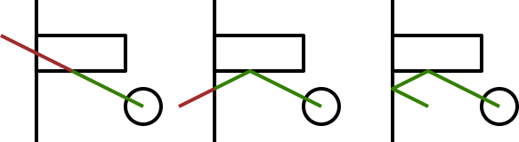

# Ball Move Handler Planning

When using physical modelling, you must ensure that you don't overstep
collision when objects are moving very quickly.

Checking for the first collision works out most of the time, but still
has potential corner cases.

Recursively processing the first collision and then updating to that
point should handle every case.
